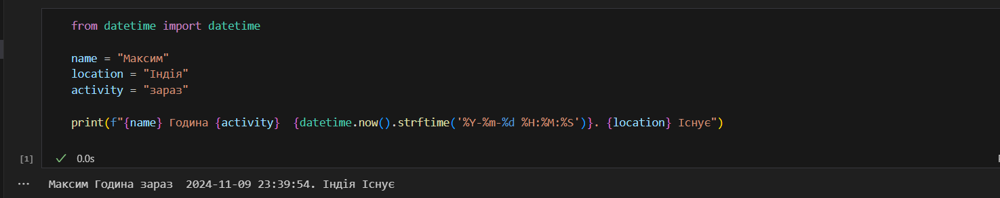

# Звіт до першої лабораторної
## Тема: перша програма на мові *Python*

### Виконання роботи
- Результати виконання завдання:
    1. Виконали першу програму, результат виконання: ;
    1. Модифікували програму та використали [Python Notebook для її виконання](lab1.ipynb);
    
    
    
    1. Програма вивела значення
    1. Отримано наступні результати Максим Година Відпочиває  2024-11-09 23:38:56. Індія Існує
    1. Навчились прості програми на мові Python


___


```Python
from datetime import datetime

name = "Максим"
location = "Індія"
activity = "Відпочиває"

print(f"{name} Година {activity}  {datetime.now().strftime('%Y-%m-%d %H:%M:%S')}. {location} Існує")


```
